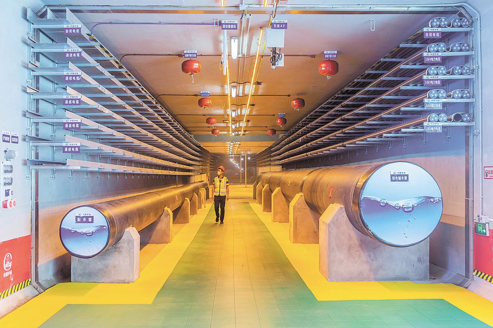
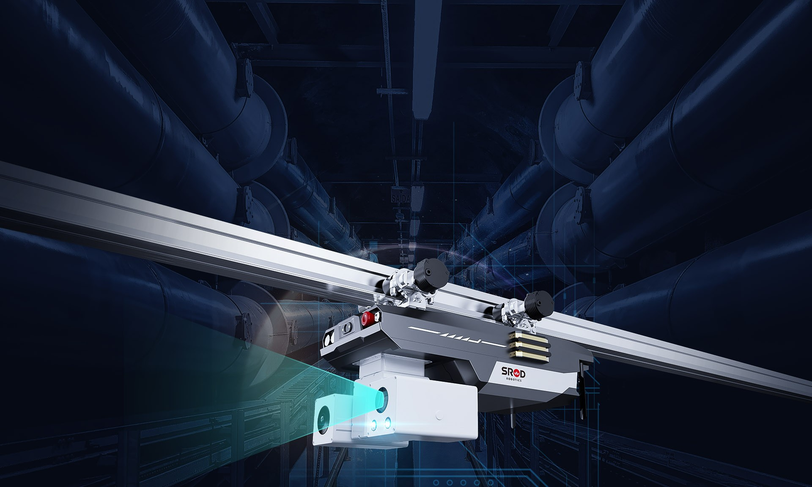
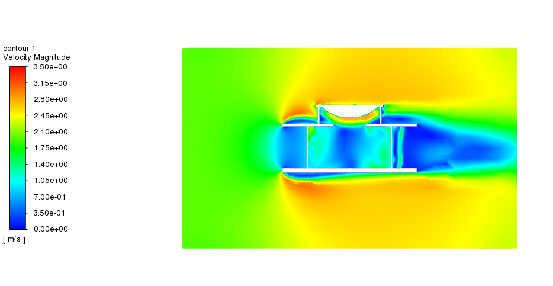
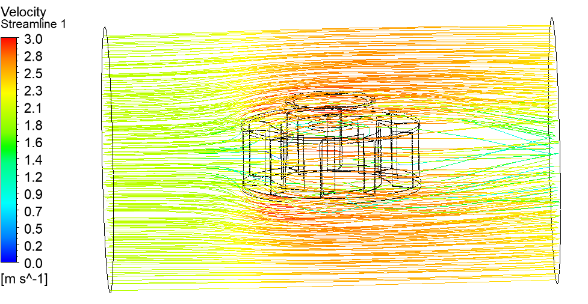
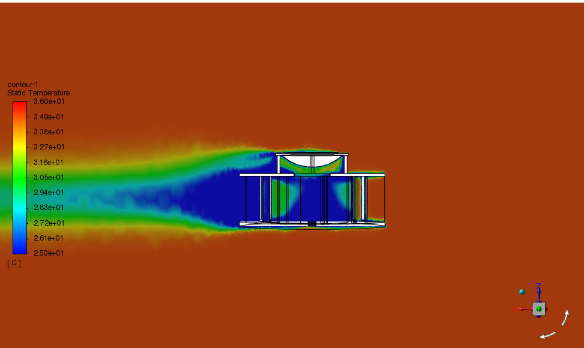
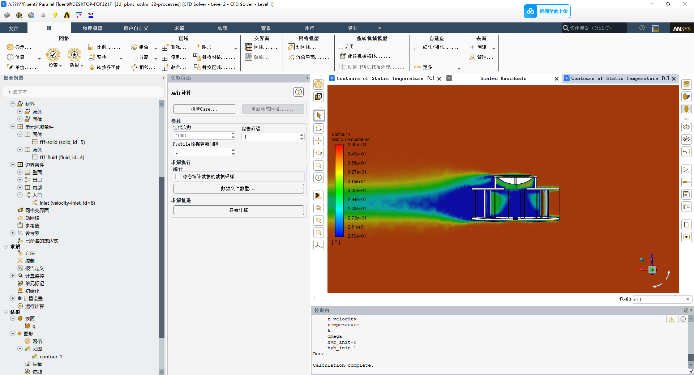

 <h1>“绿动未来”——一种面向地下管廊巡检机器人的光伏风力双驱供电系统</h1>
  
目前，地下管廊已成为将传统管道运输集成和升级后的综合走廊，在实施各管道运输工作的统一规划、统一设计、统一建设起到决定性作用。而地下管廊巡检机器人作为城市基础设施智能化管理的重要工具，其续航能力直接决定了巡检效率和覆盖范围。传统供电方式依赖电池或外部电源，存在续航时间短、更换频繁、能源消耗大等问题。
为了解决这一难题，本文创新地设计出一款基于地下管廊巡检机器人的风光双驱供电装置。本装置通过采集地面上的风能和太阳能，为地下管廊巡检机器人提供持续、稳定的能源支持。

# 地下管廊

  

# 巡检机器人

  

# 系统结构设计

## 地上系统Solidworks三维模型
### 地上系统主要由以下部分组成
- 太阳能板（用于光伏发电）
- 风力发电机（垂直轴四叶片）
- 导流罩（用于增加风力发电机转速，增加太阳能板附近传热，提升系统发电量）
- 外壳（用于支撑系统）
- 铅蓄电池（用于储存发出的电量，并向地下输电）

  

## 地下系统Solidworks三维模型
## 地下系统主要由无线充电桩组成。功能如下：
将地上采集到的风能和太阳能转换为电能，储存在蓄电池中。将蓄电池中的电能输送到地下充电装置中。基于电磁感应原理，装置内的发射线圈通电后，会产生交变磁场，接收端的线圈安装于巡检机器人中，当地下管廊巡检机器人电量较低时，行驶到充电区就会停靠在充电装置旁，交变磁场在接收线圈中感应出电流，从而实现能量的传输，进行充电。

  

# 使用ANSYS对结构进行热力学仿真和流体力学仿真

## 流体力学仿真

  

  

## 热力学仿真

  

  

# 制作实物测试
相关视频已保存在百度网盘中，可通过网盘进行下载
